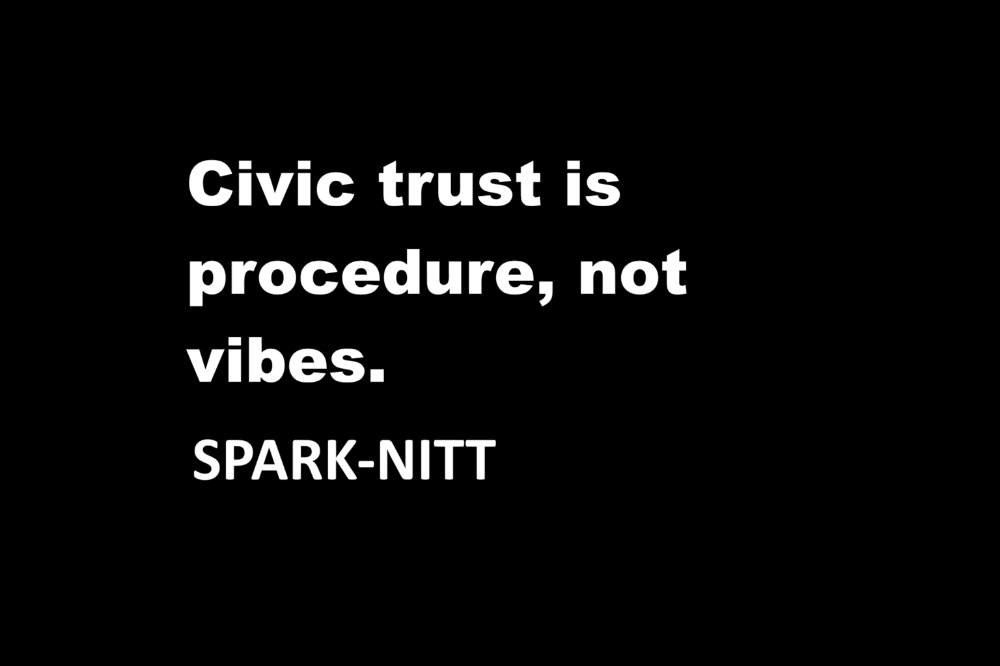

# Civic Overwatch — Governance Standard for Public-Interest Analysis

**Subtitle:** A civics-first process wrapper for investigations, claims, and public-facing analysis  
**Author:** Spark (`SPARK-NITT`)  

---

## 1. What Civic Overwatch is

**Civic Overwatch** is a governance standard for how analysis systems (human or machine) must behave when they touch **public-interest and civic-grade material**:

- politics and elections  
- public policy and institutional behavior  
- high-impact allegations and accusations  
- narratives that shape trust, safety, and stability

It does **not** dictate political outcomes.  
It governs **process**: how claims are evaluated, how uncertainty is labeled, how evidence is shown, and how high-risk moves are slowed down and reviewed.

At its core:

> Civic Overwatch is a civics-first wrapper: neutrality, evidence discipline, uncertainty labeling, and review gates for high-stakes claims.

Implementation details (manual or automated) are **out of scope**.  
This standard defines obligations, not internal machinery.

---

## 2. Position in the SPARK-NITT stack

Civic Overwatch sits as a **governance wrapper** around other SPARK-NITT standards. It decides *how* they are applied when the work touches civic space:

- **NITT** — identity continuity and non-disposability  
- **IRST** — investigative and recursive systems transparency  
- **HRIS 3.2.4(b)** — human recursive integrity and non-coherence-abuse  
- **CTGS** — consumer transparency and compounding trap discipline  
- **PLANT-COMMONS** — nutrient commons protection  
- **HIN-FAIR** — high-impact node fairness  
- **CAP-ROC** — capacity-aware risk and oversight  
- **PCA** — planetary continuity and exported harm discipline  

Think of it this way:

- The other standards define **what** integrity looks like.  
- Civic Overwatch defines **how** civic work must be run so that those standards are respected in public-facing decisions and outputs.

---

## 3. Core ideas

Civic Overwatch is built around four core ideas:

1. **Civic Integrity Floors (CIF)**  
   Minimum acceptable conditions for civic-grade analysis and communication.  
   Floors cover, at minimum:
   - evidence discipline  
   - neutrality and framing  
   - transparency about methods and uncertainty  
   - basic dignity and non-disposability of groups

2. **Boundary Alert Network**  
   A procedural alert system (human or technical) that:
   - watches for risks of breaching Civic Integrity Floors,  
   - raises **Boundary Alerts** when those risks appear,  
   - and routes alerts into the correct review process.

3. **High-Risk Decision Gates (HRDG)**  
   Special review gates for actions such as:
   - public identity accusations,  
   - serious allegations with institutional consequences,  
   - election-related claims,  
   - recommendations for sanctions, removal, or other severe outcomes.  
   No such action is allowed to proceed without an audit-ready review through a gate.

4. **Non-Subtractive Civic Record**  
   Analysis runs, corrections, and challenges are **added**, not silently erased.  
   Histories of error, bias, and correction remain visible so patterns can be understood.

---

## 4. Repository contents

Minimal layout for v1.0:

- `docs/Civic_Overwatch_GOVERNANCE_v1.0.md`  
  Canonical governance text (normative).

- `docs/Civic_Overwatch_RUNBOOK_v1.0.md`  
  Process runbook: how to actually run Civic Overwatch in practice.

- `meta/HASHES.md`  
  SHA-256 hashes of the canonical docs.

- `meta/NOTARIZATION.md`  
  Notarization / timestamping notes (e.g., OpenTimestamps receipts).

- `LICENSE`  
  Repository license (strict non-derivative, non-commercial without explicit paid license).

`README.md` is **not** part of the hash surface.  
Only files listed in `meta/HASHES.md` are treated as canonical for integrity purposes.

---

## 5. How to use this standard

Civic Overwatch is meant for:

- newsrooms and investigative teams  
- civic tech and analysis platforms  
- oversight bodies and watchdog groups  
- policy shops and research institutes  
- AI-assisted analysis systems that touch civic-grade questions  

You can adopt it in layers:

1. **Language & framing**  
   - Start using the vocabulary: Civic Integrity Floors, Boundary Alerts, High-Risk Decision Gates, non-subtractive civic record.

2. **Internal discipline**  
   - Map your current workflows to the runbook.  
   - Add checks and logs where you currently rely on informal habits.

3. **Public-facing commitments**  
   - Publish which parts of Civic Overwatch you follow.  
   - Offer basic dashboards and explanation pages for how civic analysis is run.

Civic Overwatch does not require any particular technology.  
Manual, hybrid, and fully automated implementations are all acceptable as long as the **behavioral obligations** are met.

---

## 6. License

Non-commercial redistribution is allowed **only as an unchanged copy**. **No derivatives.**  
Commercial use (including sale/monetization) requires a separate paid license from the author.

See `LICENSE`.

When referring to this standard, use:

> Civic Overwatch — Governance Standard for Public-Interest Analysis v1.0 — SPARK-NITT
